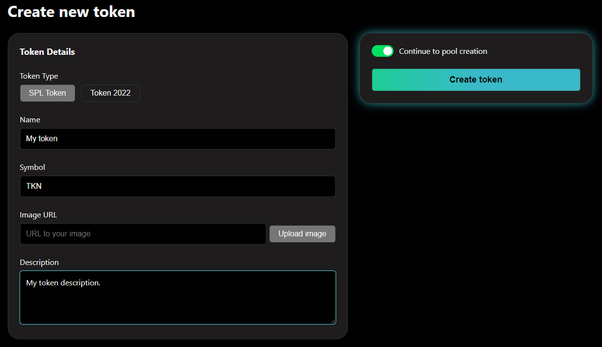

# 🛠️ How to create a token


<mark style="color:orange;">Token creation step-by-step guide for</mark> <mark style="color:purple;">**LaunchPoint**</mark><mark style="color:orange;">.</mark>


***

### Step 1 - Token details

**->** After connecting your wallet to the LaunchPoint platform, click the **Create Pool** tab and you will be automatically prompted to the **token creation** menu. If you want to create an LBP on LaunchPoint, our platform offers users the option to create the token that will be used for the LBP IF the user does not already have a pre-existing token that they want to create a LBP with.

<figure><figcaption>
Create Pool tab highlighted.
</figcaption></figure>

**->** In the token creation menu, the first parameters that can be configured are the token details such as: `token type` (SPL token or token 2022), `name`, `symbol`, `image` (you can use an external URL or click the `Upload image` button) and token `description`.

**->** In this example, we have chosen to create an SPL token and we clicked the `Upload image`  button and chose an image from our local computer.


**Note**: that the `Continue to pool creation` option is toggled, this means that after the token has been created the user will be automatically redirected to the LBP pool creation page.


<figure><figcaption>
Token Details menu.
</figcaption></figure>

### Step 2 - Advanced settings

#### Token mint address

**->** The first parameter that can be configured here is the token mint address (this address will show up in explorers and will be in the LBP's URL).

**->** You can click the `Regenerate` button in order for a new custom token mind address to be generated **OR** you can click the `Use a pre-generated private key` if you want to use a vanity address (you can generate it offline with `solana key-gen grind` and use it on this section). For more details you can visit this [link](https://www.quicknode.com/guides/solana-development/getting-started/how-to-create-a-custom-vanity-wallet-address-using-solana-cli).

**->** For the sake of speed and simplicity, in this example we have chosen to use the custom generated key offered directly by LaunchPoint.

<figure><figcaption>
Custom generated token mint address.
</figcaption></figure>

#### Token supply parameters&#x20;

**->** The next field refers to the number of `decimals` that you want to set for your new token. You can choose any number between 1 and 9. In our example we chose the number 6.

**->** The next field refers to the initial supply of your token. By default, LaunchPoint sets this value to 0. That means that after creating the token you will have 0 balance of the created token and, when proceeding to the LBP creation menu, the Add tokens by minting option will be automatically ENABLED. For more details visit this [link](how-to-create-lbps.md#add-tokens-by-minting-no-pre-existing-token-balance).

**->** Should you choose however, you can set your token balance to anything between 0 and 10000000000.

**->** In our example we have chosen 0.

<figure><figcaption>
Decimals and initial supply for the custom token.
</figcaption></figure>

#### Custom token authorities

**->** The final parameters that can be configured are the contract authorities. Here's a complete explanation of what they are and what they mean:

1. **Mint authority:**
   * This grants the ability to create (mint) new tokens of your SPL token.
   * In the context of an LBP, the mint authority is typically used to mint the initial token supply that will be distributed during the LBP.
   * **Technical perspective:** Minting new tokens involves modifying the total supply on the blockchain. Only the wallet with mint authority has the cryptographic keys necessary to perform this transaction.
   * **Community perspective:** Revoking mint authority assures the community that no additional tokens can be minted beyond the initial supply, preventing inflation and protecting the token's value.
2. **Freeze authority:**
   * This grants the ability to freeze specific token accounts, essentially preventing the owner of those accounts from transferring or selling their tokens.
   * This authority is rarely used for LBPs, but it could be helpful in exceptional circumstances, such as identifying fraudulent activity or recovering stolen tokens.
   * **Technical perspective:** Freezing a token account involves setting a flag on the blockchain that restricts transfers. Only the freeze authority can modify this flag.
   * **Community perspective:** Having freeze authority in place provides some level of control in case of unforeseen issues, but excessive use can erode trust as it limits user ownership rights.
3. **Metadata authority:**
   * This grants the ability to update the metadata associated with your SPL token. Metadata can include details like the token name, symbol, logo, and website URL.
   * Updating metadata after an LBP can be useful for adding new information or reflecting project developments.
   * **Technical perspective:** Metadata is stored on the blockchain but can be updated by the authority using a specific transaction.
   * **Community perspective:** The ability to update metadata allows for ongoing communication and transparency with the community. However, frequent or unnecessary changes could raise concerns about the project's stability.

**Revoking vs. not revoking authority:**

* **Revoking authority:**
  * This involves removing the ability to perform specific actions (minting, freezing, or updating metadata) from a wallet address.
  * It's generally **recommended to revoke mint and freeze authority** to prevent unauthorized actions.
  * Revoking metadata authority might be considered depending on your project's update needs and the level of control you desire.
* **Not revoking authority:**
  * Leaving authority un-revoked can be risky, especially for mint authority.
  * It could allow unauthorized minting in the future, potentially harming the token's value.
  * Not revoking freeze authority might be acceptable if you don't foresee any situations requiring freezing tokens.
  * Leaving metadata authority un-revoked allows for future updates, but consider the potential for community concerns about frequent changes.

**->** By default LaunchPoint will have the `Revoke freeze authority` and `Revoke metadata authority` options ENABLED in the custom token creation menu.

**->** We will showcase the default setting of the options for this guide.

<figure><figcaption>
Freeze and metadata authority are revoked.
</figcaption></figure>

### Step 3 - Token creation

**->** The final step after configuring all the parameters is the creation of the token.&#x20;

**->** In order to initiate this step, you must click the `Create token` button .

<figure><figcaption>
Create token final step
</figcaption></figure>

**->** After clicking the `Create token button` confirm the transaction in your wallet.

<figure><figcaption>
Token creation transaction.
</figcaption></figure>

**->** After confirming the token creation transaction, your custom token will have been created and you will automatically be redirected to the LBP creation menu.

<figure><figcaption>
Custom token summary.
</figcaption></figure>
